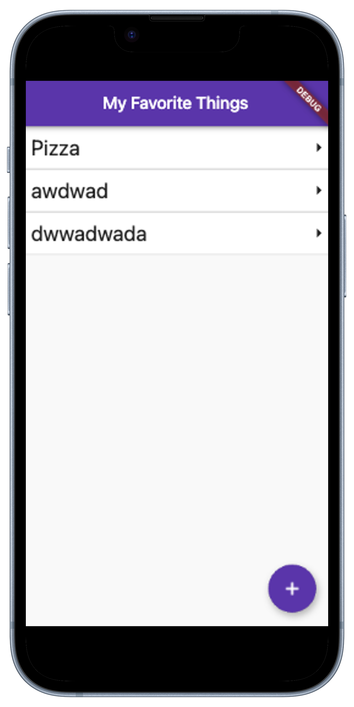

# 🚀 Overview

This Flutter app is designed for the Enterprise Software Development (ESD)  workshop to introduce the basics of Flutter and Dart programming. The app, titled "My Favorite Things", allows users to create a list of their favorite items, view details, and add new items. It demonstrates fundamental Flutter concepts like navigation, state management, and UI design.

# 🛠️ Task
For the interactive part of the workshop you can clone this repo on [Flutlab.io](https://flutlab.io) and try to understand or even extend the functionalities. This is your playground to be creative.
The app is designed for ease of understanding and feature richness, rather than strict adherence to best practices.

## 💡 Ideas
Feel free to explore any additions or modifications you desire. If you're looking for inspiration, here are some suggestions:
- **Shopping List Transformation:** 🛒 Convert the app into a shopping list. Implement features like item deletion, marking items as purchased, and sorting by priority or categories.
- **Personal Diary:** 📔 Turn it into a personal diary or journal app. Introduce features to add entries with dates, edit entries, and perhaps include mood icons or weather.
- **Task Manager:** 📋 Morph it into a task management app. Add functionalities for setting deadlines, reminders, categorizing tasks, and marking them as complete.
- **Photo Album:** 📸 Convert the app into a photo album. Allow users to add photos, captions, and organize them into albums or by dates.
- **Recipe Book:** 🍳 Transform it into a recipe book where users can add, view, and categorize recipes. Include features for ingredients, cooking steps, and preparation time.

# 📖 Explanation

## 🌈 Functionalities
- **List Display:** 📝 The home screen shows a list of favorite items.
- **Navigation:** 🚦 Users can navigate between the home screen, details screen, and add item screen.
- **Add New Item:** ➕ Users can add new items to the list which will be displayed on the home screen.
- **View Details:** 🔍 Users can view more details about an item by tapping on it.
  
## 📁 File Structure
The project is organized into several directories for clarity and maintainability:

<pre>
lib/ 
├── main.dart                           # The entry point of the application.
├── models/
│   └── favorite_item.dart              # Defines the FavoriteItem class.
├── screens/
│   ├── home_screen.dart                # Home page, displays the list of favorite items.
│   ├── details_screen.dart             # Page showing detailed info about a selected item.
│   └── add_item_screen.dart            # Page for adding a new favorite item.
└── widgets/
    └── favorite_item_card.dart         # Reusable widget for displaying an item in the list.
</pre>

## 🔧 Code Structure
<pre>
├── main.dart
│   ▶️ Sets up the MaterialApp
│   ▶️ Defines routes
│   ▶️ Applies the app theme
│
├── models/
│   └── favorite_item.dart
│       ▶️ Contains the model for favorite items
│
├── screens/
│   ├── home_screen.dart
│   │   ▶️ Displays a list of items using ListView.builder
│   │   ▶️ Implements navigation to the details and add item screens
│   │
│   ├── details_screen.dart
│   │   ▶️ Shows details of a selected item, passed through navigation
│   │
│   └── add_item_screen.dart
│       ▶️ Contains a form to add new items and passes them back to the home screen
│
└── widgets/
    └── favorite_item_card.dart
        ▶️ Custom widget to display each item in a card format
</pre>

